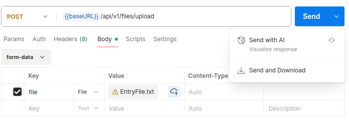
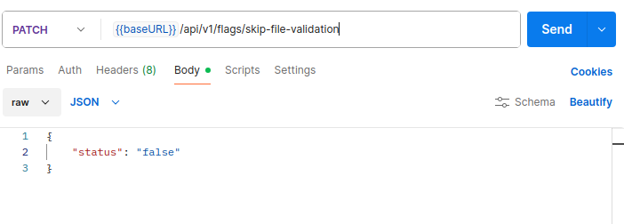

# File Parsing Service Task for [COMPANY]

# Run Steps

I used Kotlin compiler v1.8.22 / Java compiler v17.0.16

Run the spring server: `./gradlew bootRun`

# Usage

By default, the spring server should run on http://localhost:8080

Use that as the base URL and append the following endpoints. I used PostMan for testing.

To upload the resource file, use `/api/v1/files/upload` and attach the file to the request.

In PostMan, add the file to the form-data, and select the `Send and Download` option when sending the request:

Control the feature flag by using `/api/v1/flags/{flag}` providing a `status` field for a boolean in the request body.

i.e. To control and see the status of `skip-file-validation` feature flag, use `/api/v1/flags/skip-file-validation`

